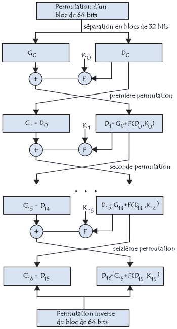
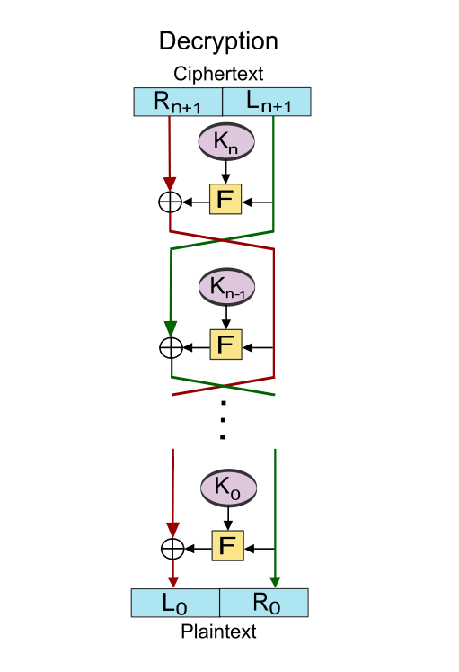

# CryptoDES

## Description
Ce script python permet d'effectuer un chiffer un texte avec l'algorythme DES
et de déchiffrer ceux-ci.

## Principe du chiffrement DES
DES est un algorythme de chiffrement créé en 1974 par IBM sous le nom de "Lucifer" puis changera de nom pour porter l'actuel "DES" en 1976.

IL s'agit d'un systeme de chiffrement symetrique, c'est à dire que la clef permettant de chiffrer le méssage est aussi la clef permettant de déchiffrer ce même méssage.

cette clef doit être de 64 bits dont 8 de controle qui permette de vérifier que le nombre de 1 par octet est bien impaire et permette donc de vérifier que la clef soit valide.
Puis, suite à des permutations, un découpage puis un décalage de bits, 16 nouvelles clefs vont être créée à partir ce la première.

Ensuite, le méssage vas être convertit en binaire puis découpé en blocs de 64 bits.
Enfin une une "Ronde" est aplliqué 16 fois de suites, cela correspond à:
  1. Fractionnement du texte en blocs de 64 bits (8 octets) ;
  2. Permutation initiale des blocs ;
  3. Découpage des blocs en deux parties: gauche et droite, nommées G et D ;
  4. Recollement des parties gauche et droite puis permutation initiale inverse.

  

Pour le dechiffrement il faut donc faire les étapes en sans inverse, c'est à dire d'utilisé les clef de 15 à 0 et de remplacer D par G et G par  P[S[E[G] ⊕ K[x]]]


## Commandes
Dans ce script vous pouvez utiliser les commandes suivantes:
  + __encrypt__ : permet de chiffrer un message
  + __decrypt__ : permet de déchiffrer un message
  + __all__ : permet de chiffrer puis de déchiffrer un message

## Utilisation
Pour l'utiliser vous devez passez les lignes de commande suivantes:
```bash
python main.py encrypt `path/to/file` `path/to/key`

python main.py decrypt `path/to/file` `path/to/key`

python main.py all `path/to/file` `path/to/key`
```
